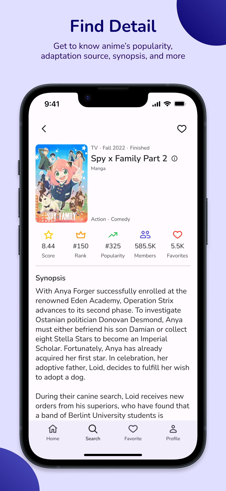
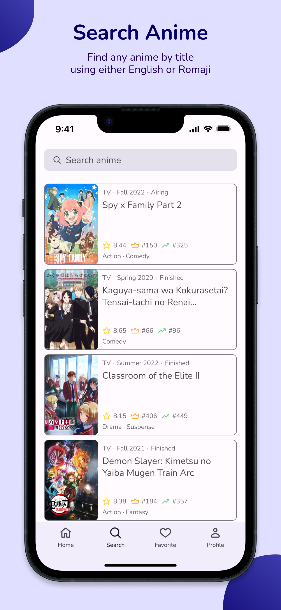
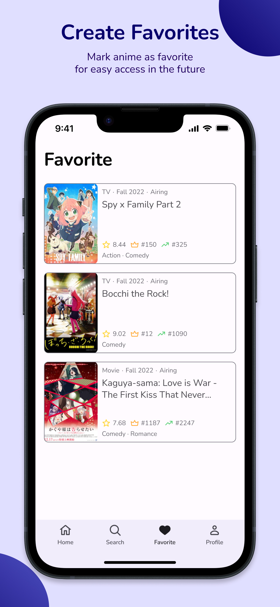

# Yume
Discover anime anywhere, anytime

Get to know various information about anime such as season, score, rank, adaptation source, synopsis, and more. Find any anime by title using either in English or Rōmaji. Create your own favorite list for easy access.

Yume is available in English and Bahasa Indonesia.
> Support for Bahasa Indonesia is limited to some features and can only be used by changing device's system language

## Features

 
 
 
 
 

### Home
- Top airing anime
- Top upcoming anime
- Most popular anime
- Top rated anime

### Search
- Top favorite anime
- Search anime by title using either English or Rōmaji

### Favorite
- List of anime added to favorite

### Profile

## Getting Started

### Prerequisites

#### OS & Software
> Requirements might be lower, the app is developed using the system listed below
* macOS Ventura 13.1
* Xcode 14.2
* iOS 16.2

#### App
* Client ID (API token) from [MyAnimeList](https://myanimelist.net/apiconfig)

### Installation

1. Download the repository
2. Open the project by using Xcode
3. Build the project and a `Keys.plist` file should be created automatically at `Yume/Supporting Files/`
   > If it isn't created automatically, copy `Keys-Example.plist` at `Yume/Supporting Files/` and paste it as `Keys.plist` at `Yume/Supporting Files/`
4. Replace the value of key `API_KEY` with your Client ID (API token) at Keys.plist

## License

This project is licensed under the MIT License - see the [LICENSE.md](https://github.com/bryanless/Yume-Swift/blob/main/LICENSE) file for details

## Acknowledgments

* [MyAnimeList API](https://myanimelist.net/apiconfig/references/api/v2) by [MyAnimeList](https://myanimelist.net)
